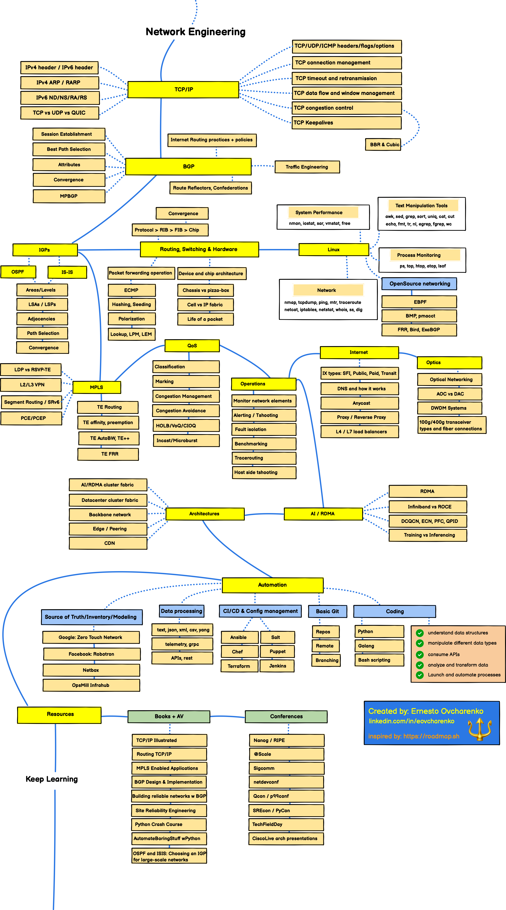

# KISTI + KREONET 환경을 고려한 네트워크 엔지니어 로드맵

## ✅ 핵심 포인트
**KISTI**는 국가 슈퍼컴퓨터, 연구데이터 허브, 국가연구망(KREONET)을 운영하는 핵심 기관입니다.  
**KREONET**은 국내 연구기관, 대학, 병원 등을 초고속 네트워크로 연결하는 L2/L3 백본 연구망이며, 해외 연구망(APAN, GEANT 등)과도 연동됩니다.

주요 특징:
- 대규모 백본 네트워크 운영 경험
- SDN, IPv6, 고속 전송(100G 이상), 멀티도메인 전송 기술 노출
- 클라우드·연구망 융합 환경 실험 가능
- 공공기관 및 연구기관 협업 경험

---

## 🛠 네트워크 엔지니어 로드뷰 (신입 기준)

### ✅ 1년 차: 연구망 구조 이해 + 운영 기초 익히기
**기술 목표**
- 네트워크 기초 (TCP/IP, OSI 7계층, 서브넷 계산 등)
- 리눅스, Cisco 장비 CLI 완숙도 향상
- Python 기본 문법 및 네트워크 자동화 툴(Netmiko, NAPALM) 학습
- KREONET 백본 구조 및 트래픽 흐름, 장비 구성 학습

**실무 경험**
- 라우터/스위치 설정 변경, 장애 처리 보조
- NetFlow, SNMP, 로그 모니터링 분석
- 연구망 트래픽 흐름 문서화 및 구성도 작성

**자기 개발**
- 네트워크 기초 실습: VPC, Subnet, Routing Table, IGW 등 (GNS3, Cisco Packet Tracer, 실제 장비)
- Github 정리 습관화

---

### ✅ 3년 차: 클라우드 융합 + 자동화 적용
**기술 목표**
- Python + Ansible 자동화 실무 적용
- SDN / Segment Routing 개념 학습 및 PoC 실습

**실무 경험**
- 클라우드 ↔ 온프레미스 연동 실습 (VPN, Direct Connect 구성 등)
- 기관 간 BGP 구성, 멀티홈 라우팅 경험
- 자동화 스크립트로 설정 백업, 장비 점검 등 운영 효율화

---

### ✅ 5년 차: 클라우드 네트워크 전문가로 전환
**기술 목표**
- AWS Advanced Networking Specialty + Terraform 숙련
- SDN, ONOS/ODL 실습 적용
- 클라우드 네트워크 보안, 로깅, 가시성 모니터링 설계

**실무 경험**
- 연구망과 클라우드 연동 인프라 구축 주도
- SD-WAN, 멀티클라우드 아키텍처 설계 참여
- 고속 네트워크 기반 대용량 데이터 전송 최적화

# 
